# FestCine — Fase 1: Modelado Lógico de Datos

## 1. Diagrama Entidad-Relación (DER)

El diagrama se presenta en notación *crow's foot* (Mermaid). Puede visualizarse en
GitHub, VS Code (con la extensión Mermaid) o en https://mermaid.live.

```mermaid
erDiagram
    %% ==================== EDICIONES ====================
    EDICION ||--o{ PELICULA : "recibe postulación de"
    EDICION ||--o{ CATEGORIA : "define"
    EDICION ||--o{ EVENTO : "organiza"
    EDICION ||--o{ ACREDITACION : "emite"
    EDICION ||--o{ PATROCINIO : "recibe"
    EDICION ||--o{ ALOJAMIENTO : "coordina"
    EDICION ||--o{ TRASLADO : "coordina"

    %% ==================== CATÁLOGO ====================
    PELICULA ||--o{ PELICULA_GENERO : ""
    GENERO   ||--o{ PELICULA_GENERO : ""
    PELICULA ||--o{ PELICULA_PERSONA : ""
    PERSONA  ||--o{ PELICULA_PERSONA : ""
    ROL      ||--o{ PELICULA_PERSONA : ""

    %% ==================== AGENDA ====================
    SEDE ||--o{ SALA : "contiene"
    SEDE ||--o{ EVENTO : "alberga"
    SALA ||--o{ PROYECCION : "exhibe"
    PELICULA ||--o{ PROYECCION : "se proyecta en"
    EVENTO ||--o{ EVENTO_EXPOSITOR : ""
    PERSONA ||--o{ EVENTO_EXPOSITOR : "expone en"

    %% ==================== COMPETICIÓN ====================
    CATEGORIA ||--o{ CATEGORIA_JURADO : ""
    PERSONA   ||--o{ CATEGORIA_JURADO : "es jurado en"
    CATEGORIA ||--o{ PELICULA_CATEGORIA : ""
    PELICULA  ||--o{ PELICULA_CATEGORIA : "compite en"
    PELICULA_CATEGORIA ||--o{ EVALUACION : "recibe"
    CATEGORIA_JURADO   ||--o{ EVALUACION : "emite"
    PELICULA_CATEGORIA ||--o| PREMIO : "gana"

    %% ==================== VENTAS ====================
    ASISTENTE ||--o{ ACREDITACION : "posee"
    ASISTENTE ||--o{ VENTA : "realiza"
    VENTA ||--o{ PAGO : "se paga con"
    VENTA ||--o| FACTURA : "se factura en"
    VENTA ||--o{ ENTRADA : "incluye"
    VENTA ||--o| ABONO : "incluye"
    TARIFA ||--o{ ENTRADA : "aplica a"
    TARIFA ||--o{ ABONO : "aplica a"
    PROYECCION ||--o{ ENTRADA : "da acceso a"
    EVENTO     ||--o{ ENTRADA : "da acceso a"
    TIPO_ABONO ||--o{ ABONO : "clasifica"
    ABONO ||--o{ CODIGO_ACCESO : "genera"
    PROYECCION ||--o{ CODIGO_ACCESO : "se canjea en"

    %% ==================== LOGÍSTICA ====================
    PERSONA ||--o{ ALOJAMIENTO : "se hospeda"
    HOTEL   ||--o{ ALOJAMIENTO : "ofrece"
    PERSONA ||--o{ TRASLADO : "viaja en"
    PATROCINADOR ||--o{ PATROCINIO : "aporta"

    PELICULA {
        int pelicula_id PK
        int edicion_id FK
        varchar titulo
        smallint anio_produccion
        smallint duracion_min
        varchar pais_origen
        text sinopsis
        enum clasificacion
        enum formato
        enum estado
    }
    PERSONA {
        int persona_id PK
        varchar nombre
        varchar apellidos
        text biografia
        varchar email
        varchar telefono
    }
    PROYECCION {
        int proyeccion_id PK
        int pelicula_id FK
        int sala_id FK
        datetime fecha_hora
        decimal precio_base
        bool tiene_qa
        int aforo_disponible "desnormalizado"
    }
    SALA {
        int sala_id PK
        int sede_id FK
        varchar nombre
        int capacidad
    }
    EVALUACION {
        int evaluacion_id PK
        int categoria_id FK
        int pelicula_id FK
        int persona_id FK
        tinyint puntuacion "CHECK 1-10"
        varchar comentario
    }
    VENTA {
        int venta_id PK
        int asistente_id FK
        enum tipo_venta
        datetime fecha_venta
        decimal total
    }
    ENTRADA {
        int entrada_id PK
        int venta_id FK
        int proyeccion_id FK "XOR con evento_id"
        int evento_id FK
        int tarifa_id FK
        decimal precio_pagado
        varchar codigo UK
    }
    ABONO {
        int abono_id PK
        int venta_id FK
        int tipo_abono_id FK
        int tarifa_id FK
        decimal precio_pagado
        varchar codigo UK
    }
```

## 2. Decisiones de diseño principales

| Decisión | Justificación |
|---|---|
| **`PERSONA` centralizada con tabla `ROL`** | El enunciado exige que una misma persona cumpla múltiples roles (director y actor en la misma obra). La relación ternaria `PELICULA_PERSONA (pelicula, persona, rol)` lo resuelve sin redundancia. Jurados y expositores también son `PERSONA`. |
| **`EDICION` como entidad raíz** | Sostiene el requisito histórico: películas, categorías, eventos, acreditaciones, patrocinios y logística referencian su edición; las consultas filtran "edición vigente" con `MAX(anio)`. |
| **`ENTRADA` con FK excluyentes (proyección XOR evento)** | Una entrada da acceso a *una* proyección **o** a *un* evento paralelo. Se garantiza con `CHECK ((proyeccion_id IS NULL) XOR (evento_id IS NULL))`. Alternativa descartada: dos tablas casi idénticas (entrada_proyeccion / entrada_evento) que duplicarían lógica de venta. |
| **`EVALUACION` con FK compuestas** | Referencia a `PELICULA_CATEGORIA` y a `CATEGORIA_JURADO` (no a las tablas base). Así el propio modelo impide que un jurado evalúe una película que no compite en su categoría o que vote alguien que no es jurado de ella. |
| **`PREMIO` con `UNIQUE(categoria_id)`** | Garantiza un único ganador por categoría a nivel de esquema. |
| **`VENTA` como cabecera + `PAGO` + `FACTURA`** | Separa el hecho comercial (venta) del medio de pago y del documento fiscal, lo que permite la transacción T1 (pago rechazado ⇒ rollback de todo el grafo). |
| **Asistente ≠ Persona** | Los asistentes son clientes (compran entradas); el personal cinematográfico participa en obras. Mantenerlos separados evita NULLs masivos y confusión de identidades. La "acreditación Jurado" de un asistente es un pase de acceso, no su membresía en un panel. |

## 3. Normalización

### Primera Forma Normal (1FN)
Todos los atributos son atómicos. Los grupos repetitivos se extrajeron a tablas:
- Géneros de una película → `PELICULA_GENERO` (N:M).
- Roles del personal → `PELICULA_PERSONA` (ternaria).
- Códigos de acceso de un abono → `CODIGO_ACCESO` (una fila por código).

### Segunda Forma Normal (2FN)
Las tablas con clave compuesta (`PELICULA_GENERO`, `PELICULA_PERSONA`,
`CATEGORIA_JURADO`, `PELICULA_CATEGORIA`, `EVENTO_EXPOSITOR`) no tienen
atributos no clave, por lo que no existen dependencias parciales.
`EVALUACION` usa clave sustituta y restricción `UNIQUE(categoria, pelicula,
persona)`; sus atributos (`puntuacion`, `comentario`) dependen de la
combinación completa.

### Tercera Forma Normal (3FN)
Se eliminaron dependencias transitivas:
- `SALA.capacidad` depende de la sala, no de la proyección → vive en `SALA`.
- Datos del hotel (nombre, dirección) → tabla `HOTEL`; `ALOJAMIENTO` solo referencia.
- `descuento_pct` depende de la tarifa → tabla `TARIFA`.
- `precio_base` y `num_accesos` dependen del tipo de abono → `TIPO_ABONO`.
- Datos del patrocinador → `PATROCINADOR`; la aportación por edición → `PATROCINIO`.

### Desnormalizaciones deliberadas (justificación exigida por el enunciado)

| Atributo | Por qué se desnormaliza |
|---|---|
| `PROYECCION.aforo_disponible` | Es derivable (`capacidad − entradas − canjes`), pero la venta de boletería es la operación más frecuente y concurrente del sistema: validar cupo con un contador bloqueado con `SELECT ... FOR UPDATE` es O(1) y evita sobreventa, frente a un `COUNT(*)` sobre dos tablas en cada compra. Solo lo escriben el trigger (inicialización) y los procedimientos almacenados. |
| `ENTRADA.precio_pagado`, `ABONO.precio_pagado`, `VENTA.total` | **Snapshot histórico**: si mañana cambia `precio_base` o el `descuento_pct` de una tarifa, los informes financieros de ediciones pasadas no deben alterarse. Es el mismo criterio de cualquier sistema de facturación. |
| `EVENTO.aforo_disponible` | Mismo argumento de rendimiento que en proyección. |

## 4. Asunciones documentadas

1. **Una película se postula a una sola edición.** Si una obra se re-postulara
   al año siguiente se registraría como nueva fila (decisión simplificadora).
2. **El estado de la película es global por edición** (`Postulada → Seleccionada/Rechazada → Premiada`).
   Solo películas `Seleccionada` o `Premiada` pueden programarse en agenda
   (validado por `sp_programar_proyeccion`).
3. **Tarifas como catálogo con porcentaje de descuento** sobre el precio base de
   cada proyección/abono. La tarifa **VIP tiene 100% de descuento**: la entrada
   cuesta $0 pero se registra para control de aforo, como exige el enunciado.
4. **Moneda: bolivianos (BOB, símbolo Bs)**, con los campos `DECIMAL(10,2)`
   admitiendo decimales (centavos).
5. **IVA del 19% incluido en el precio**; la factura lo desglosa
   (`subtotal = total / 1.19`).
6. **Venta en taquilla = pago en efectivo aprobado** (P1). La venta de abonos
   pasa por pasarela en línea (T1), cuya respuesta se simula con el parámetro
   `p_pago_aprobado`.
7. **El abono otorga N códigos de acceso de un solo uso** (`TIPO_ABONO.num_accesos`).
   Cada canje (`sp_usar_codigo_abono`) descuenta aforo igual que una entrada.
   No se modela la restricción de días ("fin de semana") por simplicidad.
8. **Limpieza de sala: 30 minutos** después de cada proyección (regla del
   trigger TR1). El rango ocupado es `[inicio, inicio + duración + 30 min]`.
9. **Una acreditación por asistente y edición** (`UNIQUE(asistente_id, edicion_id)`).
   Quien no tiene fila en `ACREDITACION` es *Público General*.
10. **Los eventos paralelos se ubican en una sede** (no en una sala específica)
    y manejan su propio aforo; no participan del trigger de agenda de salas.
11. **No se modelan reembolsos**: una venta registrada con pago aprobado es
    definitiva. Los pagos rechazados nunca persisten (ROLLBACK en T1).
12. **El "Premio del Público"** se registra operativamente como las demás
    categorías: un representante del comité carga la votación agregada como
    evaluación de jurado.
13. **La edición vigente** es la de mayor `anio` en `EDICION`.
14. **Autenticación de la aplicación:** los clientes se registran e inician
    sesión mediante procedimientos almacenados (`sp_registrar_asistente`,
    `sp_login_asistente`). La cuenta vive en `ASISTENTE` (columnas `usuario`
    único y `clave_hash`); la contraseña se almacena como hash **SHA-256**
    calculado por el servidor y el inicio de sesión acepta **correo o nombre
    de usuario**. En producción se usaría un algoritmo con salt (bcrypt). El
    administrador usa credenciales fijas configurables (`admin/admin123`) con
    acceso discreto desde el login, y actúa además como *cajero*: puede
    registrar ventas a nombre de cualquier asistente (Módulo 1). Las cuentas
    precargadas tienen contraseña `12345678`.
15. **Toda venta emite factura:** además de la exigida en T1 (abonos), el
    procedimiento P1 también factura las entradas, de modo que la aplicación
    muestra la confirmación de compra como factura y permite descargarla en
    PDF (póster, función, tarifa y desglose de IVA).
16. **Las imágenes de pósters y banners** se descargaron de la cartelera
    pública de cinemark.com.bo con fines exclusivamente académicos.

## 5. Modelo de implementación

El modelo relacional resultante (32 tablas) está implementado en
[sql/01_esquema.sql](../sql/01_esquema.sql) con todas las restricciones de
integridad: llaves primarias, foráneas (incluidas FK compuestas), `UNIQUE`,
`CHECK` y `NOT NULL`. La programación del lado del servidor (función,
procedimientos P1/T1, triggers TR1 y vistas) está en
[sql/02_programacion.sql](../sql/02_programacion.sql).
